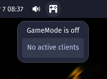

# GameMode Status Cosmic Applet


 

## Install

```sh
git clone https://github.com/D-Brox/cosmic-ext-applet-system-monitor 
cd cosmic-ext-applet-emoji-selector 
```

For debian based distros you can build and install as a deb package:
```sh
just build-deb
sudo just install-deb
```

For any other distros, run:
```sh
just build-release
sudo just install
```

## Contributing

Contributions are welcome

To build and install the debug build

```sh
just build-debug && sudo just debug=1 install
```

## Special Thanks

- [gicmo](https://github.com/gicmo) for their [GNOME Shell system monitor extension](https://github.com/gicmo/gamemode-extension), the inspiration for this applet
- [edfloreshz](https://github.com/edfloreshz) for the [template for COSMIC applets](https://github.com/edfloreshz/cosmic-applet-template), which taught me the logic behind an applet